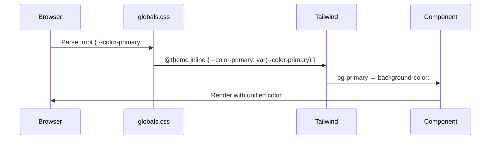
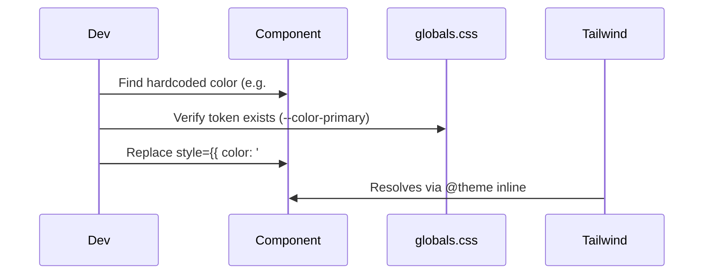

# Design Document: Design System Unification

## Overview

Vitae currently has two divergent color palettes living side-by-side: the "Clinical Curator" palette (`#0058bd` primary blue, teal, pink-red) defined in `app/globals.css` and used by the app shell, and the "Digital Health" palette (`#1d4ed8` blue, `#a855f7` violet, `#ec4899` pink) defined in `app/homepage.css` and `app/(auth)/auth/auth.css` as scoped CSS variables under `.hp {}` and `.ap {}`. The dashboard page (`app/(app)/dashboard/page.tsx`) already uses the Digital Health palette via hardcoded inline styles, creating a third divergence point.

The goal is a single source of truth: the Digital Health palette becomes the canonical app-wide palette, all tokens are defined once in `globals.css`, all components consume them as Tailwind utility classes, and page-level CSS files are reduced to layout/animation concerns only  no color re-definitions.

---

## Architecture

```mermaid
graph TD
    A[globals.css  single source of truth] -->|@theme inline| B[Tailwind utility classes]
    B --> C[components/ui  primitives]
    B --> D[components/features  feature components]
    B --> E[app pages  layout + page-level CSS]
    
    F[homepage.css] -->|animations + layout only| E
    G[auth.css] -->|animations + layout only| E
    
    H[Old .hp CSS vars] -->|deleted| X[❌ removed]
    I[Old .ap CSS vars] -->|deleted| X
    J[Inline hardcoded colors] -->|migrated to tokens| B
```

### Token Flow

```mermaid
graph LR
    A[":root hex values"] -->|CSS custom properties| B["--color-primary: #1d4ed8"]
    B -->|@theme inline| C["Tailwind: bg-primary"]
    C -->|className| D["<Button className='bg-primary'>"]
```

---

## Sequence Diagrams

### Token Resolution at Render Time



### Migration Flow for a Component



---

## Components and Interfaces

### Component Inventory

All existing `components/ui/` primitives already use semantic Tailwind tokens correctly. They require **no color changes**  only the token values they reference will change.

| Component | Current tokens used | Status |
|-----------|-------------------|--------|
| `Button` | `bg-primary`, `text-primary-foreground`, `bg-primary-hover`, `bg-surface-muted`, `bg-surface-subtle`, `bg-tertiary` | ✅ Token-clean |
| `Card` | `bg-surface-container-lowest`, `bg-surface-subtle`, `shadow-md` | ✅ Token-clean |
| `Badge` | `bg-primary-subtle`, `bg-success-subtle`, `bg-warning-subtle`, `bg-error-subtle`, `bg-info-subtle` | ✅ Token-clean |
| `Input` | `bg-surface-subtle`, `bg-surface-container-lowest`, `ring-error`, `ring-border-strong` | ✅ Token-clean |
| `Heading` | `text-text-primary`, `text-text-secondary` | ✅ Token-clean |
| `Section` | `text-text-primary`, `text-text-secondary` | ✅ Token-clean |
| `Accordion` | `divide-border`, `border-border`, `bg-surface`, `bg-surface-subtle`, `text-text-primary`, `text-text-muted` | ✅ Token-clean |
| `Spinner` | `text-primary` | ✅ Token-clean |

### Feature Components Requiring Migration

These components use hardcoded hex values or `.hp`/`.ap` scoped CSS variables that must be replaced with Tailwind tokens:

| Component | Issue | Migration action |
|-----------|-------|-----------------|
| `ProfileChip.tsx` | Inline `#1d4ed8`, `#7c3aed`, `#c026d3`, `#64748b`, `#f1f4fb` | Replace with `text-primary`, `bg-primary-subtle`, `text-text-muted`, `bg-surface-subtle` |
| `RecordCard.tsx` | Inline `#1d4ed8`, `#7c3aed`, `#0d9488`, `#0891b2` | Replace with `text-primary`, `text-teal`, token-based gradients |
| `LabAlertCard.tsx` | Inline `#be123c`, `#d97706`, `#e11d48`, `#f59e0b` | Already uses `bg-error-subtle`, `text-error`, `bg-warning-subtle`  gradient headers stay as inline (intentional brand moment) |
| `dashboard/page.tsx` | Inline gradient `#0f0f2d → #1d4ed8 → #7c3aed → #c026d3`, inline `rgba()` values | Extract gradient to a CSS utility class in `globals.css` |
| `homepage.css` | Defines `.hp { --blue, --violet, --pink, ... }`  duplicates globals | Remove all color variable definitions; keep only animations and layout |
| `auth.css` | Defines `.ap { --blue, --violet, --pink, ... }`  duplicates globals | Remove all color variable definitions; keep only animations and layout |

### New Tailwind Tokens Required

The Digital Health palette introduces violet and pink as first-class brand colors. These must be added to `globals.css`:

```typescript
interface NewTokens {
  // Violet  accent / AI / intelligence
  '--color-accent':         '#9333ea'  // accent purple
  '--color-accent-hover':   '#7c3aed'  // darker violet
  '--color-accent-subtle':  '#f3e8ff'  // light violet bg
  '--color-accent-foreground': '#ffffff'

  // Violet alias (used in homepage/auth)
  '--color-violet':         '#a855f7'
  '--color-violet-subtle':  '#f3e8ff'

  // Pink  gradient endpoint / family member color
  '--color-pink':           '#ec4899'
  '--color-pink-subtle':    '#fce7f3'

  // Gradient utilities (defined as CSS classes, not tokens)
  // .gradient-brand: linear-gradient(135deg, #1d4ed8 0%, #a855f7 100%)
  // .gradient-brand-full: linear-gradient(135deg, #1d4ed8 0%, #a855f7 55%, #ec4899 100%)
  // .gradient-hero: linear-gradient(135deg, #0f0f2d 0%, #1d4ed8 45%, #7c3aed 80%, #c026d3 100%)
}
```

---

## Data Models

### Token Architecture

The token system follows a three-layer model:

```typescript
// Layer 1: Raw values  defined once in :root
interface RootTokens {
  // Primary (Digital Health blue  replaces Clinical Curator #0058bd)
  '--color-primary':            '#1d4ed8'
  '--color-primary-hover':      '#1e40af'
  '--color-primary-subtle':     '#dbeafe'
  '--color-primary-container':  '#dbeafe'
  '--color-primary-foreground': '#ffffff'

  // Accent / Violet
  '--color-accent':             '#9333ea'
  '--color-accent-hover':       '#7c3aed'
  '--color-accent-subtle':      '#f3e8ff'
  '--color-accent-foreground':  '#ffffff'

  // Violet (alias for homepage/auth compatibility)
  '--color-violet':             '#a855f7'
  '--color-violet-subtle':      '#f3e8ff'

  // Pink
  '--color-pink':               '#ec4899'
  '--color-pink-subtle':        '#fce7f3'

  // Teal  health tracks (unchanged)
  '--color-teal':               '#006a66'
  '--color-teal-subtle':        '#dff4f2'

  // Tertiary / Error (unchanged)
  '--color-tertiary':           '#ab2653'
  '--color-tertiary-subtle':    '#ffd9e2'

  // Surface hierarchy (bg shifts to Digital Health bg)
  '--color-surface':                    '#f8f9ff'  // was #f7f9ff
  '--color-surface-subtle':             '#f2f3ff'  // was #f1f4fa
  '--color-surface-muted':              '#e8edf5'  // unchanged
  '--color-surface-container-lowest':   '#ffffff'  // unchanged

  // Typography (unchanged)
  '--color-text-primary':       '#07071a'  // was #181c21, matches hp --text
  '--color-text-secondary':     '#16163a'  // was #43474e, matches hp --text-2
  '--color-text-muted':         '#3b3b62'  // was #74777f, matches hp --text-m

  // Borders (violet-tinted, matches Digital Health)
  '--color-border':             'rgba(168,85,247,0.13)'  // was #dde2ec
  '--color-border-subtle':      'rgba(168,85,247,0.08)'  // was #edf0f7
  '--color-border-strong':      'rgba(168,85,247,0.25)'  // was #c8cdd6
}

// Layer 2: @theme inline  maps CSS vars to Tailwind utilities
// (mirrors Layer 1 exactly, no new values)

// Layer 3: Tailwind utility classes consumed by components
// bg-primary, text-primary, border-border, bg-accent-subtle, etc.
```

### Gradient Utility Classes

Gradients cannot be expressed as single-value CSS custom properties in Tailwind v4. They are defined as named CSS classes in `globals.css`:

```css
/* Gradient utilities  defined in globals.css, used via className */
.gradient-brand {
  background: linear-gradient(135deg, var(--color-primary) 0%, var(--color-violet) 100%);
}
.gradient-brand-full {
  background: linear-gradient(135deg, var(--color-primary) 0%, var(--color-violet) 55%, var(--color-pink) 100%);
}
.gradient-hero {
  background: linear-gradient(135deg, #0f0f2d 0%, var(--color-primary) 45%, var(--color-accent-hover) 80%, #c026d3 100%);
}
.gradient-cta-box {
  background: linear-gradient(135deg, #060a1f 0%, #1a1068 40%, #5b21b6 72%, #7c3aed 100%);
}
```

---

## Algorithmic Pseudocode

### Token Migration Algorithm

```pascal
ALGORITHM migrateTokens
INPUT: globals_css, homepage_css, auth_css, component_files[]
OUTPUT: unified_globals_css, stripped_homepage_css, stripped_auth_css, migrated_components[]

BEGIN
  // Phase 1: Update globals.css
  SEQUENCE
    root_block ← globals_css.getRootBlock()
    
    // Replace Clinical Curator primary with Digital Health primary
    root_block.set('--color-primary', '#1d4ed8')
    root_block.set('--color-primary-hover', '#1e40af')
    root_block.set('--color-primary-subtle', '#dbeafe')
    
    // Add new tokens (violet, pink, accent)
    root_block.add('--color-accent', '#9333ea')
    root_block.add('--color-accent-hover', '#7c3aed')
    root_block.add('--color-accent-subtle', '#f3e8ff')
    root_block.add('--color-violet', '#a855f7')
    root_block.add('--color-violet-subtle', '#f3e8ff')
    root_block.add('--color-pink', '#ec4899')
    root_block.add('--color-pink-subtle', '#fce7f3')
    
    // Update surface and text tokens to match Digital Health
    root_block.set('--color-surface', '#f8f9ff')
    root_block.set('--color-surface-subtle', '#f2f3ff')
    root_block.set('--color-text-primary', '#07071a')
    root_block.set('--color-text-secondary', '#16163a')
    root_block.set('--color-text-muted', '#3b3b62')
    root_block.set('--color-border', 'rgba(168,85,247,0.13)')
    
    // Mirror new tokens in @theme inline block
    theme_block ← globals_css.getThemeBlock()
    FOR each new_token IN root_block.newTokens DO
      theme_block.add(new_token.name, 'var(' + new_token.name + ')')
    END FOR
    
    // Add gradient utility classes
    globals_css.append(GRADIENT_UTILITIES)
    
    unified_globals_css ← globals_css
  END SEQUENCE
  
  // Phase 2: Strip color vars from homepage.css and auth.css
  FOR each scoped_css IN [homepage_css, auth_css] DO
    SEQUENCE
      var_block ← scoped_css.getScopedVarBlock()  // .hp { ... } or .ap { ... }
      var_block.removeAllColorVars()               // remove --blue, --violet, --pink, etc.
      // Keep: animations, layout rules, component-specific styles
      stripped_css ← scoped_css
    END SEQUENCE
  END FOR
  
  // Phase 3: Migrate feature components
  FOR each component IN component_files DO
    SEQUENCE
      inline_styles ← component.findInlineStyles()
      
      FOR each style IN inline_styles DO
        IF style.value MATCHES hardcoded_color_pattern THEN
          token ← COLOR_MAP.lookup(style.value)
          IF token EXISTS THEN
            component.replaceInlineStyle(style, 'className=' + token)
          ELSE
            // Color not in token map  add to globals.css first
            ASSERT false, 'Unmapped color: ' + style.value
          END IF
        END IF
      END FOR
      
      migrated_components.add(component)
    END SEQUENCE
  END FOR
  
  RETURN unified_globals_css, stripped_homepage_css, stripped_auth_css, migrated_components
END
```

**Preconditions:**
- `globals.css` has a valid `:root {}` block and `@theme inline {}` block
- All components in `components/ui/` already use semantic tokens (no migration needed)
- `homepage.css` and `auth.css` are only imported by their respective page files

**Postconditions:**
- No color hex values appear in `homepage.css` or `auth.css` variable blocks
- No hardcoded hex colors appear in feature component `style={{}}` props (except intentional brand gradients)
- All new tokens appear in both `:root` and `@theme inline`
- Tailwind utility classes resolve correctly for all new tokens

**Loop Invariants:**
- For each processed component: all previously migrated inline styles have been replaced with Tailwind classes
- Token map remains consistent throughout iteration

### Color Mapping Table

```pascal
CONSTANT COLOR_MAP = {
  // Digital Health blues
  '#1d4ed8' → 'text-primary / bg-primary / border-primary',
  '#1e40af' → 'text-primary-hover / bg-primary-hover',
  '#dbeafe' → 'bg-primary-subtle / text-primary-subtle',

  // Violet / accent
  '#9333ea' → 'text-accent / bg-accent',
  '#7c3aed' → 'text-accent-hover / bg-accent-hover',
  '#f3e8ff' → 'bg-accent-subtle / bg-violet-subtle',
  '#a855f7' → 'text-violet / bg-violet',

  // Pink
  '#ec4899' → 'text-pink / bg-pink',
  '#fce7f3' → 'bg-pink-subtle',

  // Teal (unchanged)
  '#006a66' → 'text-teal / bg-teal',
  '#dff4f2' → 'bg-teal-subtle',
  '#0d9488' → 'text-teal',  // Tailwind teal-600  map to --color-teal

  // Surfaces
  '#f8f9ff' → 'bg-surface',
  '#f2f3ff' → 'bg-surface-subtle',
  '#ffffff'  → 'bg-surface-container-lowest',

  // Text
  '#07071a' → 'text-text-primary',
  '#16163a' → 'text-text-secondary',
  '#3b3b62' → 'text-text-muted',
  '#64748b' → 'text-text-muted',  // Tailwind slate-500  close enough

  // Borders
  'rgba(168,85,247,.12)' → 'border-border',
  'rgba(168,85,247,.13)' → 'border-border',
}
```

---

## Key Functions with Formal Specifications

### Function 1: Token Definition in `:root`

```css
/* In globals.css :root block */
:root {
  --color-primary: #1d4ed8;
  --color-violet:  #a855f7;
  --color-pink:    #ec4899;
  /* ... */
}
```

**Preconditions:**
- Each token name is unique within `:root`
- Hex values are valid CSS color values
- No token references another token (raw values only in `:root`)

**Postconditions:**
- Token is available as a CSS custom property on all elements
- Token value can be overridden per-scope if needed (e.g., dark mode in future)

### Function 2: Token Registration in `@theme inline`

```css
/* In globals.css @theme inline block */
@theme inline {
  --color-primary: var(--color-primary);
  --color-violet:  var(--color-violet);
  --color-pink:    var(--color-pink);
}
```

**Preconditions:**
- Corresponding `:root` token exists
- Token name in `@theme inline` matches `:root` exactly
- Tailwind v4 is configured to process this file

**Postconditions:**
- `bg-primary`, `text-primary`, `border-primary` utility classes are generated
- `bg-violet`, `text-violet` utility classes are generated
- `bg-pink`, `text-pink` utility classes are generated

**Loop Invariants:**
- For each token in `@theme inline`: a matching token exists in `:root`

### Function 3: Component Token Consumption

```typescript
// Correct pattern  semantic token via Tailwind class
function ProfileChip({ isActive }: { isActive: boolean }) {
  return (
    <div
      className={isActive
        ? 'bg-primary text-primary-foreground'
        : 'bg-surface-subtle text-text-muted'
      }
    />
  )
}
```

**Preconditions:**
- Token referenced in `className` exists in `@theme inline`
- Component does not mix `className` tokens with `style={{}}` overrides for the same property

**Postconditions:**
- Component renders with correct color from the unified palette
- Color updates automatically when `:root` token value changes

---

## Example Usage

### Before: Divergent (current state)

```typescript
// dashboard/page.tsx  hardcoded inline gradient
<div style={{ background: 'linear-gradient(135deg, #0f0f2d 0%, #1d4ed8 45%, #7c3aed 80%, #c026d3 100%)' }}>

// ProfileChip.tsx  hardcoded inline colors
<div style={{ background: 'linear-gradient(135deg, #1d4ed8, #7c3aed, #c026d3)' }}>
<span style={{ color: isActive ? '#1d4ed8' : '#64748b' }}>

// homepage.css  duplicate color vars
.hp {
  --blue: #1d4ed8;
  --violet: #a855f7;
  --pink: #ec4899;
}

// auth.css  same vars again
.ap {
  --blue: #1d4ed8;
  --violet: #a855f7;
}
```

### After: Unified (target state)

```typescript
// dashboard/page.tsx  named gradient class
<div className="gradient-hero">

// ProfileChip.tsx  semantic tokens
<div className={isActive ? 'gradient-brand' : 'bg-surface-subtle'}>
<span className={isActive ? 'text-primary' : 'text-text-muted'}>

// homepage.css  no color vars, only animations
.hp {
  /* animations only  colors come from globals.css tokens */
}

// auth.css  no color vars, only animations
.ap {
  /* animations only  colors come from globals.css tokens */
}

// globals.css  single source of truth
:root {
  --color-primary: #1d4ed8;
  --color-violet:  #a855f7;
  --color-pink:    #ec4899;
}
```

---

## Correctness Properties

*A property is a characteristic or behavior that should hold true across all valid executions of a system — essentially, a formal statement about what the system should do. Properties serve as the bridge between human-readable specifications and machine-verifiable correctness guarantees.*

### Property 1: Single Token Definition

*For any* color value used in the app, there exists exactly one definition in `globals.css :root`. No color hex value appears in more than one CSS file's variable block.

**Validates: Requirements 1.1**

### Property 2: Token Completeness

*For any* Tailwind utility class `bg-X`, `text-X`, or `border-X` used in any component file, there exists a corresponding `--color-X` entry in both `:root` and `@theme inline` in `globals.css`.

**Validates: Requirements 1.2, 1.3**

### Property 3: No Scoped Re-definition

*For any* CSS custom property definition (`--variable: value`) that appears in `homepage.css` or `auth.css` after migration, the definition SHALL NOT exist — the `.hp {}` and `.ap {}` blocks contain zero `--` variable declarations. All `var(--X)` references in those files resolve to tokens defined in `globals.css :root`.

**Validates: Requirements 3.1, 3.2, 3.3**

### Property 4: Gradient Isolation

*For any* page or component that renders a gradient hero section, the gradient is applied via a named CSS utility class (`gradient-hero`, `gradient-brand`, etc.) rather than an inline `style={{}}` prop containing a `linear-gradient` value.

**Validates: Requirements 2.3, 4.7**

### Property 5: Component Token Purity

*For any* component in `components/features/` or an `app/(app)/` page file, no hardcoded hex color value (`#[0-9a-fA-F]{3,6}`) appears in a `style={{}}` prop — all colors flow through Tailwind utility classes or CSS custom properties.

**Validates: Requirements 4.1, 4.2, 4.3, 4.4, 4.5, 4.6**

### Property 6: New Component Rendering Completeness

*For any* valid set of props passed to GradientHeroHeader, PageHeader, EmptyState, SectionHeader, or ListItem, the rendered output SHALL contain all required prop values as visible text or elements — no required prop is silently dropped.

**Validates: Requirements 5.1, 5.2, 5.3, 5.4, 5.5, 5.6, 5.8, 5.9, 5.10**

---

## Error Handling

### Scenario 1: Missing token in `@theme inline`

**Condition**: A component uses `bg-violet` but `--color-violet` is not in `@theme inline`  
**Response**: Tailwind generates no utility class; the element renders with no background  
**Recovery**: Add `--color-violet: var(--color-violet)` to the `@theme inline` block in `globals.css`

### Scenario 2: Token defined in `:root` but not `@theme inline`

**Condition**: `--color-violet: #a855f7` exists in `:root` but not in `@theme inline`  
**Response**: `var(--color-violet)` works in raw CSS but `bg-violet` Tailwind class does not exist  
**Recovery**: Mirror the token in `@theme inline`; restart dev server

### Scenario 3: Scoped CSS variable shadows global

**Condition**: `.hp { --color-primary: #0058bd }` overrides the global token inside `.hp` scope  
**Response**: Components inside `.hp` render with the old Clinical Curator blue  
**Recovery**: Remove the scoped override; the global token value is the correct one

### Scenario 4: Inline style overrides Tailwind class

**Condition**: `<div className="bg-primary" style={{ background: '#0058bd' }}>`  inline wins  
**Response**: Element renders with hardcoded old color, ignoring the token  
**Recovery**: Remove the `style` prop; rely on the Tailwind class

---

## Testing Strategy

### Unit Testing Approach

Each migrated component should be visually verified against the Digital Health palette reference. Key assertions:

- Primary buttons render with `#1d4ed8` background (not `#0058bd`)
- Active `ProfileChip` renders with the blue→violet gradient ring
- `RecordCard` prescription stripe uses `#1d4ed8` (not `#0058bd`)
- `Badge` primary variant uses `#dbeafe` background (not `#dce8ff`)

### Property-Based Testing Approach

**Property Test Library**: Not applicable for CSS token migration  visual regression testing is more appropriate.

**Visual regression approach**: Take screenshots of key pages before and after migration and diff them. Pages to capture:
- `/` (homepage)  must be pixel-identical
- `/auth`  must be pixel-identical  
- `/dashboard`  gradient hero should match Digital Health palette
- `/dashboard/upload/[profileId]`  upload picker colors

### Integration Testing Approach

1. **Token resolution test**: In a browser devtools console, verify `getComputedStyle(document.body).getPropertyValue('--color-primary')` returns `#1d4ed8` after migration.

2. **No-orphan-var test**: Search all CSS and TSX files for `var(--` references and verify each referenced variable exists in `globals.css :root`.

3. **No-hardcoded-hex test**: Run a grep for `#[0-9a-fA-F]{3,6}` in `components/` and `app/` (excluding `globals.css` and `homepage.css` animation keyframes)  result should be empty or limited to intentional brand gradient endpoints.

---

## Performance Considerations

- Removing duplicate CSS variable blocks from `homepage.css` and `auth.css` reduces CSS payload by ~2–3 KB per file
- Replacing inline `style={{}}` objects with static Tailwind classes improves React render performance (no new object allocation per render)
- Gradient utility classes (`.gradient-brand`, `.gradient-hero`) are defined once in CSS and reused, vs. inline strings that are re-evaluated each render

---

## Security Considerations

No security implications. This is a pure visual/CSS refactor with no changes to authentication, data handling, or API surface.

---

## Dependencies

- **Tailwind CSS v4**  `@theme inline` syntax required (already in use)
- **Next.js 16**  CSS module scoping and `import './homepage.css'` pattern (already in use)
- **Plus Jakarta Sans**  font already loaded in `app/layout.tsx`; no changes needed
- No new npm packages required
